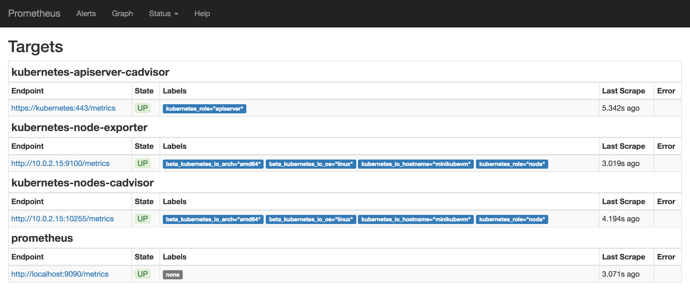
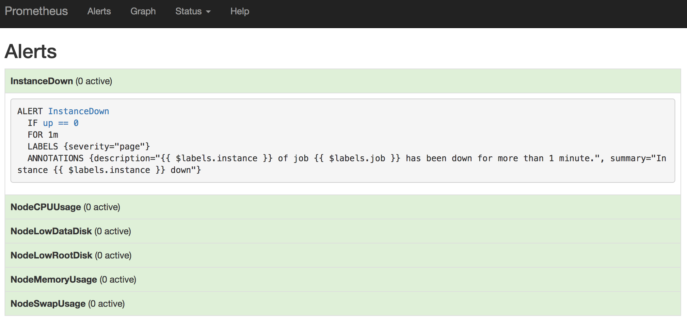
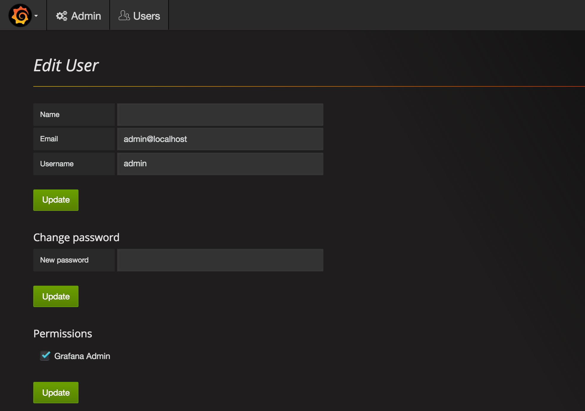
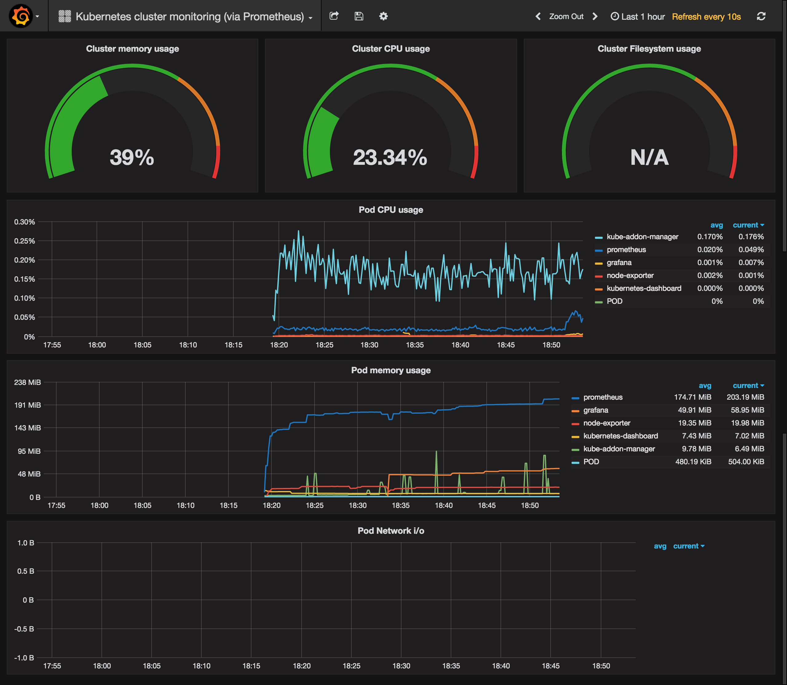

+++
title = "Monitoring with Prometheus and Grafana"
description = "Recipe to spin up a monitoring setup with Prometheus and Grafana on Kubernetes."
date = "2017-02-10"
type = "page"
weight = 100
tags = ["recipe"]
+++

# Monitoring with Prometheus and Grafana

[Prometheus](https://prometheus.io/) is an open-source monitoring solution that includes the gathering of metrics, their storage in an internal time series database as well as querying and alerting based on that data.

It offers a lot of integrations incl. Docker, Kubernetes, etc.

Prometheus can also visualize your data. However, in this recipe we include another open-source tool, [Grafana](http://grafana.org/), for the visualization part, as it offers a more powerful and flexible way to generate visuals and dashboards.

## Deploying Prometheus and Grafana

The following command will set you up with all neccesary components and some first dashboards to check out.

```bash
kubectl apply --filename https://raw.githubusercontent.com/giantswarm/kubernetes-prometheus/master/manifests-all.yaml
```

## Checking Prometheus

Wait a bit for all the pods to come up. Then Prometheus should be ready and running. We can check the Prometheus targets at `https://api.<cluster-id>.k8s.gigantic.io/api/v1/proxy/namespaces/monitoring/services/prometheus:9090/targets`



*Note*: The above URL uses your Kubernetes API to proxy to the service. As the API is guarded with your credentials, you need to [set them up in your system](/guides/accessing-services-from-the-outside/) (and/or browser). We do not recommend to set up an Ingress for Prometheus at this time, as it currently does not support any kind of authentication and thus your cluster would be open to everyone.

## Checking Alertmanager

Prometheus shows the active alerts and rules under `/alerts` in the prometheus frontend:



A full list of all rules can also be seen under `/rules`. The Alertmanager frontend offers more options to look at active and silenced alerts.

## Checking Grafana

Now that we know Prometheus is up and running we can check for Grafana.

There's an Ingress set up for Grafana, however, you need to set it to your desired domain. You can do this by editing the ingress:

```bash
kubectl --namespace monitoring edit ingress grafana
```

This will open the ingress YAML in your standard editor. In the `host` field replace `yourchoice` with a subdomain of your choice and `clusterid` with your cluster ID. After saving and exiting your editor, wait a while and Grafana should be available at `http://<yourchoice>.<cluster-id>.k8s.gigantic.io/`.

You can use the default admin (`admin:admin`) user for your first login. You should change this admin user to reflect your desired username, your email, and a secure password ASAP!

_Note:_ If persistent storage is not set up in your cluster, changes like the above will be reset to defaults if the Grafana Pod gets rescheduled. You would need to set them again after that.

## Changing the admin

You can change the default admin user at http://grafana.monitoring.<cluster-id>.k8s.gigantic.io/admin/users/edit/1



Please note, that you need to update the password and the user data (username, email, etc.) separately with the respective update buttons below each section.

## Check out your dashboards

You can now checkout the included dashboards, e.g. the [Cluster Monitoring Overview](http://grafana.monitoring.l8.k8s.gigantic.io/dashboard/db/kubernetes-cluster-monitoring-via-prometheus).



_Note:_ If persistent storage is not set up in your cluster, the preset datasource and dashboards will vanish if the Grafana Pod gets rescheduled. To get them back run:

```nohighlight
kubectl --namespace=monitoring delete job grafana-import-dashboards
kubectl --namespace=monitoring create --filename https://raw.githubusercontent.com/giantswarm/kubernetes-prometheus/master/manifests/grafana/import-dashboards/job.yaml
```

## Next Steps

Next, you should get into the [Grafana](http://docs.grafana.org/) and [Prometheus](https://prometheus.io/docs/introduction/overview/) documentations to get to know the tools and either build your own dashboards or extend the samples from above.

You can also check out grafana.net for some more example [dashboards](https://grafana.net/dashboards) and [plugins](https://grafana.net/plugins).

You might also want to set up some [alerting](https://prometheus.io/docs/alerting/overview/).
