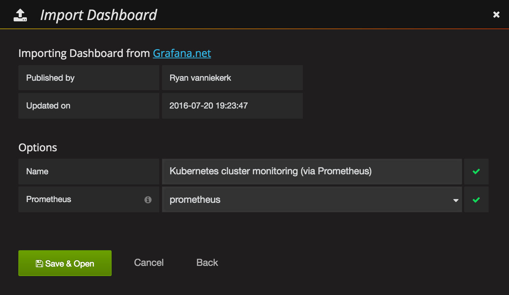

+++
title = "Monitoring with Prometheus and Grafana"
description = "Recipe to spin up a monitoring setup with Prometheus and Grafana on Kubernetes."
date = "2016-09-29"
type = "page"
weight = 100
categories = ["recipes"]
+++

# Monitoring with Prometheus and Grafana

[Prometheus](https://prometheus.io/) is an open-source monitoring solution that includes the gathering of metrics, their storage in an internal time series database as well as querying and alerting based on that data.

It offers a lot of integrations incl. Docker, Kubernetes, etc.

Prometheus can also visualize your data. However, in this recipe we include another open-source tool, [Grafana](http://grafana.org/), for the visualization part, as it offers a more powerful and flexible way to generate visuals and dashboards.

If you just want to get Prometheus and Grafana up and running you can deploy the whole recipe with a single command instead of going through all steps detailed out below:

```bash
kubectl create --filename manifests/
```

## Deploying Prometheus

First, we need to create the configuration for our Prometheus. For this we use a Config Map, which we later mount into our Prometheus pod to configure it. This way we can change the configuration without having to redeploy Prometheus itself.

`kubectl create --filename manifests/prometheus-core-configmap.yaml`

Then, we create a service to be able to access Prometheus.

`kubectl create --filename manifests/prometheus-core-service.yaml`

Finally, we can deploy Prometheus itself.

`kubectl create --filename manifests/prometheus-core-deployment.yaml`

Further, we need the Prometheus Node Exporter deployed to each node. For this we use a Daemon Set and a fronting service for Prometheus to be able to access the node exporters.

```
kubectl create --filename manifests/prometheus-node-exporter-service.yaml
kubectl create --filename manifests/prometheus-node-exporter-daemonset.yaml
```

Wait a bit for all the pods to come up. Then Prometheus should be ready and running. We can check the Prometheus targets at https://mycluster.k8s.gigantic.io/api/v1/proxy/namespaces/default/services/prometheus/targets


## Deploying Alertmanager
we need to create the configuration for our Alertmanager. For this we use a Config Map, which we later mount into our Alertmanager pod to configure it. This way we can change the configuration without having to redeploy Alertmanager itself.

`kubectl create --filename manifests/prometheus-alert-configmap.yaml`

Then, we create a service to be able to access Alertmanager.

`kubectl create --filename manifests/prometheus-alert-service.yaml`

Finally, we can deploy Alertmanager itself.

`kubectl create --filename manifests/prometheus-alert-deployment.yaml`


Wait a bit for all the pods to come up. Then Alertmanager should be ready and running. We can check the Alertmanager targets at
https://mycluster.k8s.gigantic.io/api/v1/proxy/namespaces/default/services/alertmanager/


## Deploying Grafana

Now that we have Prometheus up and running we can deploy Grafana to have a nicer frontend for our metrics.

Again, we create a service to be able to access Grafana and a deployment to manage the pods.

```
kubectl create --filename manifests/grafana-services.yaml
kubectl create --filename manifests/grafana-deployment.yaml
```

Wait a bit for Grafana to come up. Then you can access Grafana at https://mycluster.k8s.gigantic.io/api/v1/proxy/namespaces/default/services/grafana/

## Setting Up Grafana

TLDR: If you don't want to go through all the manual steps below you can let the following job use the API to configure Grafana to a similar state.

```bash
kubectl create --filename manifests/grafana-import-dashboards-job.yaml
```

Once we're in Grafana we need to first configure [Prometheus](https://grafana.net/plugins/prometheus) as a data source.

- `Grafana UI / Data Sources / Add data source`
	- `Name`: `prometheus`
	- `Type`: `Prometheus`
	- `Url`: `http://prometheus:9090`
	- `Add`


Then go to the Dashboards tab and import the [Prometheus Stats dashboard](https://grafana.net/dashboards/2), which shows the status of Prometheus itself.


You can check it out to see how your Prometheus is doing.


Last, but not least we can import a sample [Kubernetes cluster monitoring dashboard](https://grafana.net/dashboards/162), to get a first overview over our cluster metrics.

-  `Grafana UI / Dashboards / Import`
	- `Grafana.net Dashboard`: `https://grafana.net/dashboards/162`
	- `Load`
	- `Prometheus`: `prometheus`
	- `Save & Open`



Voilá. You have a nice first dashboard with metrics of your Kubernetes cluster.


## Next Steps

Next, you should get into the [Grafana](http://docs.grafana.org/) and [Prometheus](https://prometheus.io/docs/introduction/overview/) documentations to get to know the tools and either build your own dashboards or extend the samples from above.

You can also check out grafana.net for some more example [dashboards](https://grafana.net/dashboards) and [plugins](https://grafana.net/plugins).

More Alertmanager documentations in [here](https://prometheus.io/docs/alerting/overview/)
